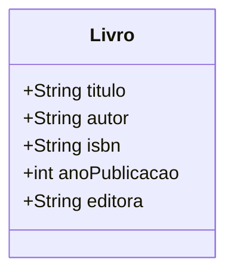

# DESCRIÇÃO
Criação de uma API para gerenciar uma coleção de livros. As operações seriam adicionar um livro, listar livros, atualizar informações de um livro e remover um livro.

```mermaid
classDiagram
    class Livro {
        +String titulo
        +String autor
        +String isbn
        +int anoPublicacao
        +String editora
    }
```

