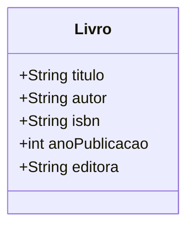

# DESCRIPTION
Creation of an API to manage a collection of books. The operations would be to add a book, list books, update information of a book, and remove a book.

# TOOLS
- **Java 17**
- **Spring Boot**

